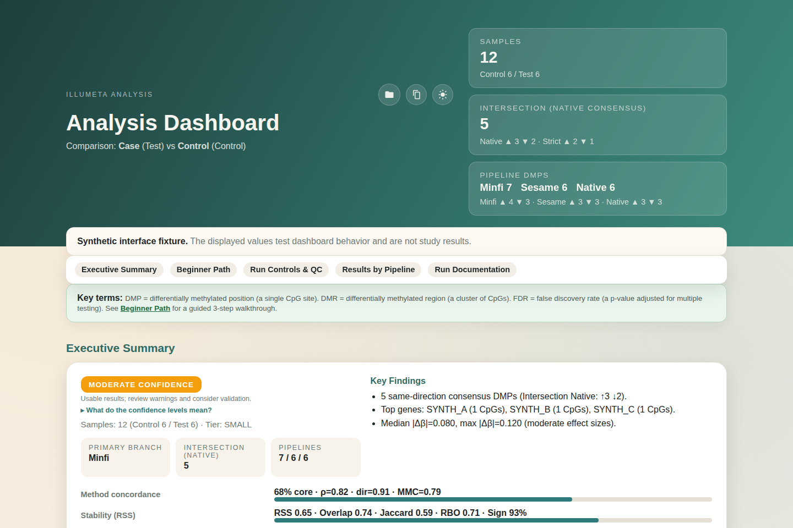

# IlluMeta: Automated DNA Methylation Analysis

[](https://github.com/kangk1204/illumeta/actions/workflows/ci.yml)
[](LICENSE)
[](environment.yml)
[](environment.yml)

IlluMeta is a command-line workflow for human Illumina DNA methylation arrays.
It downloads public GEO IDAT data or accepts local IDAT pairs, runs Minfi and
SeSAMe preprocessing routes, performs quality control and differential analysis,
and writes auditable tables plus a self-contained interactive dashboard.

<p align="center">
  <a href="docs/dashboard_demo/Case_vs_Control_results_index.html">
    
  </a>
</p>
<p align="center"><em>Synthetic interface fixture for visual and interaction testing. Values shown are not study results.</em></p>

This repository contains public source code, tests, configuration templates, and
a synthetic dashboard fixture. It does not include raw cohort data or generated
study results.

## Start Here: Fresh Ubuntu or WSL2

Paste this complete block into a new Ubuntu terminal. Windows users should run it
inside Ubuntu on WSL2 and clone under the Linux home directory, not `/mnt/c`.

```bash
sudo apt-get update
sudo apt-get install -y ca-certificates curl git

case "$(uname -m)" in
  x86_64) MINIFORGE_ARCH=x86_64 ;;
  aarch64|arm64) MINIFORGE_ARCH=aarch64 ;;
  *) echo "Unsupported CPU architecture: $(uname -m)"; exit 1 ;;
esac

curl -fsSL -o /tmp/Miniforge3.sh \
  "https://github.com/conda-forge/miniforge/releases/latest/download/Miniforge3-Linux-${MINIFORGE_ARCH}.sh"
bash /tmp/Miniforge3.sh -b -p "$HOME/miniforge3"

git clone https://github.com/kangk1204/illumeta.git
cd illumeta
./scripts/install_full.sh --preflight
./scripts/install_full.sh
./scripts/illumeta doctor
./scripts/illumeta demo
```

Wait until the installer prints `[*] Full install completed.` before running
`doctor` or `demo`. The first install downloads the conda and R/Bioconductor
stack and commonly takes 30-60 minutes. Allow at least 20 GB of free disk space.
The first demo also needs network access; later runs can reuse its cached data:

```bash
./scripts/illumeta demo --offline
```

When using the supported installer, use `./scripts/illumeta ...` for normal CLI
commands. The wrapper selects the `illumeta` conda environment and avoids mixing
system Python or R with the tested environment.

## Scope

IlluMeta currently supports:

- Human Illumina Infinium 450K, EPIC, and EPIC v2 methylation arrays.
- Public GEO downloads containing usable IDAT pairs.
- Local IDAT pairs with an IlluMeta `configure.tsv` sample sheet.
- Two-group differential methylation analysis.
- DMP, DMR, enrichment, quality-control, and interactive dashboard outputs.
- CpG-level cross-cohort meta-analysis from completed IlluMeta result folders.

IlluMeta is a research workflow, not a clinical diagnostic system. Automated
grouping, covariate selection, batch handling, and consensus calls must still be
reviewed against the study design.

## Requirements

- Linux x86_64 or ARM64, macOS, or Ubuntu on WSL2.
- Miniforge, conda, or mamba.
- At least 8 GB RAM; 16 GB or more is recommended for larger cohorts.
- At least 20 GB free disk space for the environment and package cache, plus
  space for IDAT data and outputs.
- Stable network access for the first installation and GEO download.
- macOS only: Xcode Command Line Tools (`xcode-select --install`).

## Installation

### Supported installer

```bash
git clone https://github.com/kangk1204/illumeta.git
cd illumeta
./scripts/install_full.sh --preflight
./scripts/install_full.sh
./scripts/illumeta doctor
```

Useful installer modes:

```bash
# Core analysis stack; skips optional reference packages and developer tools.
./scripts/install_full.sh --minimal

# Add optional EPIC v2, epigenetic clock, and development packages.
./scripts/install_full.sh --full

# Use a custom conda environment definition.
./scripts/install_full.sh --env-file /path/to/environment.yml --env illumeta-custom
```

The installer retries transient conda environment failures. The retry count,
delay, and log directory are configurable:

```bash
ILLUMETA_CONDA_ATTEMPTS=3 \
ILLUMETA_CONDA_RETRY_DELAY=10 \
ILLUMETA_LOG_DIR="$HOME/illumeta-logs" \
./scripts/install_full.sh
```

### macOS

Install Xcode Command Line Tools and Miniforge for the correct architecture:

```bash
xcode-select --install
uname -m
```

Apple Silicon:

```bash
curl -fsSL -o /tmp/Miniforge3.sh \
  https://github.com/conda-forge/miniforge/releases/latest/download/Miniforge3-MacOSX-arm64.sh
bash /tmp/Miniforge3.sh -b -p "$HOME/miniforge3"
```

Intel:

```bash
curl -fsSL -o /tmp/Miniforge3.sh \
  https://github.com/conda-forge/miniforge/releases/latest/download/Miniforge3-MacOSX-x86_64.sh
bash /tmp/Miniforge3.sh -b -p "$HOME/miniforge3"
```

Then clone the repository and run the supported installer above.

### Manual conda setup

```bash
git clone https://github.com/kangk1204/illumeta.git
cd illumeta
conda env create -f environment.yml
conda activate illumeta
Rscript r_scripts/setup_env.R
./scripts/illumeta doctor
```

`environment-r45.yml` is retained as an explicit R 4.5 environment entry point.
`environment/conda_illumeta_lock.yml` is the tested Linux x86_64 lock used by the
Docker image.

## Synthetic Dashboard

The tracked dashboard fixture is deterministic, offline, and made entirely from
synthetic values:

[Open the synthetic dashboard](docs/dashboard_demo/Case_vs_Control_results_index.html)

Regenerate and verify it:

```bash
conda run -n illumeta python scripts/build_dashboard_demo.py
conda run -n illumeta python -m pytest -q tests/test_dashboard_demo.py
```

The dashboard embeds no remote fonts or scripts. The synthetic tables can
search, sort, and export CSV. The fixture includes keyboard-focus states,
interactive plots, warning panels, result tables, and downloadable synthetic
source files. `docs/dashboard_demo/manifest.json` records deterministic hashes.

## Quick Demo

```bash
./scripts/illumeta demo
```

The default demo downloads the public `GSE125605` dataset once into
`projects/demo/`, prepares its sample sheet, runs the analysis, and prints the
dashboard path. A completed default run creates:

```text
projects/demo/Case_vs_Control_results_index.html
```

Re-run from cached files without network access:

```bash
./scripts/illumeta demo --offline
```

A custom demo accession must also provide matching metadata grouping values:

```bash
ILLUMETA_DEMO_GSE=GSE12345 \
ILLUMETA_DEMO_GROUP_COLUMN="disease state" \
ILLUMETA_DEMO_GROUP_CON="control" \
ILLUMETA_DEMO_GROUP_TEST="case" \
./scripts/illumeta demo
```

Inspect the downloaded `configure.tsv` before assigning labels. Metadata column
names and values differ across GEO records.

## Command Overview

```text
download  Download GEO IDAT data and prepare configure.tsv
search    Find human Illumina methylation records with IDAT files
analysis  Run quality control and differential methylation analysis
meta      Combine completed result directories at CpG level
demo      Run the public end-to-end example
doctor    Check Python, R, tools, and required packages
```

Display current options:

```bash
./scripts/illumeta --help
./scripts/illumeta analysis --help
./scripts/illumeta meta --help
```

## Search and Download

Search GEO:

```bash
./scripts/illumeta search -k "blood methylation" -o geo_idat_methylation.tsv
```

Download an accession:

```bash
./scripts/illumeta download GSE12345 -o projects/GSE12345
```

If a GEO Series contains multiple array platforms, select one explicitly:

```bash
./scripts/illumeta download GSE12345 \
  --platform GPL21145 \
  -o projects/GSE12345_GPL21145
```

The download command validates the accession, inspects GEO files, checks archive
members before extraction, verifies IDAT pairs, and writes `configure.tsv`.

## Analyze a Dataset

### GEO project with automatic grouping

```bash
./scripts/illumeta analysis \
  -i projects/GSE12345 \
  --group_con Control \
  --group_test Case \
  --auto-group \
  --group-column "disease state" \
  --tier3-on-fail skip
```

### Explicit sample sheet

Edit the `primary_group` column in `configure.tsv`, then run:

```bash
./scripts/illumeta analysis \
  --config projects/my_study/configure.tsv \
  --idat-dir projects/my_study/idat \
  --group_con Control \
  --group_test Case \
  --output projects/my_study/Case_vs_Control_results
```

Required sample sheet fields depend on input mode. At minimum, each analyzed
sample needs a stable identifier, paired red/green IDAT files, and a
`primary_group` value matching `--group_con` or `--group_test`. Preserve
biological and technical metadata columns so covariate and batch decisions can
be audited.

### Common analysis controls

```bash
./scripts/illumeta analysis \
  -i projects/GSE12345 \
  --group_con Control \
  --group_test Case \
  --auto-group \
  --group-column "disease state" \
  --pval 0.05 \
  --lfc 0.5 \
  --delta-beta 0.05 \
  --batch-column batch \
  --batch-method combat \
  --sex-mismatch-action stop \
  --fail-on-missing-idat \
  --tier3-on-fail stop
```

Threshold arguments fail closed when outside their valid domains. Review
`analysis_parameters.json`, warnings in the dashboard, and the terminal log
after every run.

## Analysis Design

IlluMeta runs Minfi and SeSAMe as distinct but dependent preprocessing routes
over the same biological samples. Agreement between routes is a preprocessing
sensitivity check; it is not independent biological replication.

The workflow includes:

1. IDAT integrity and sample-sheet validation.
2. Detection-P, signal-intensity, sex, and probe-level quality control.
3. Platform annotation and cross-reactive probe filtering.
4. Minfi and SeSAMe preprocessing.
5. Design-matrix, covariate, batch, and confounding checks.
6. Limma-based DMP analysis and DMR analysis.
7. Same-direction consensus construction across preprocessing routes.
8. Inflation diagnostics, robustness summaries, and enrichment where available.
9. Machine-readable outputs and a self-contained dashboard.

Consensus prioritizes CpGs that pass the configured criteria in both routes and
agree in direction. Because both routes use the same samples, consensus should
not be interpreted as an independent replication test.

## Output Contract

For an output directory such as
`projects/demo/Case_vs_Control_results/`, the key files include:

| File | Purpose |
| --- | --- |
| `summary.json` | Headline counts and run-level summary |
| `analysis_parameters.json` | Effective thresholds, switches, and decisions |
| `QC_Summary.csv` | Sample and probe quality-control metrics |
| `Minfi_DMPs_full.csv` | Full Minfi DMP table |
| `Sesame_DMPs_full.csv` | Full strict SeSAMe DMP table |
| `Sesame_Native_DMPs_full.csv` | Full native SeSAMe DMP table |
| `Intersection_Consensus_DMPs.csv` | Strict same-direction consensus |
| `Intersection_Native_Consensus_DMPs.csv` | Native same-direction consensus |
| `methods.md` | Generated analysis-method record |
| `sessionInfo.txt` | R session and package context |

The sibling dashboard is named from the result directory:

```text
projects/demo/Case_vs_Control_results_index.html
```

Normal dashboard generation is best effort. For automated workflows that require
the complete output contract, use the strict artifact check:

```bash
./scripts/illumeta analysis \
  -i projects/GSE12345 \
  --group_con Control \
  --group_test Case \
  --auto-group \
  --group-column "disease state" \
  --require-output-artifacts
```

This mode fails if required JSON, methods, session information, dashboard, or
supporting consensus rows are missing or internally inconsistent.

## Cross-Cohort Meta-Analysis

Pass completed result directories directly:

```bash
./scripts/illumeta meta \
  projects/cohort_a/Case_vs_Control_results \
  projects/cohort_b/Case_vs_Control_results \
  projects/cohort_c/Case_vs_Control_results \
  --output projects/meta_analysis_results
```

Or use a TSV/CSV manifest containing a `result_dir` or `path` column:

```bash
./scripts/illumeta meta \
  --manifest cohort_manifest.tsv \
  --project-root "$PWD" \
  --output projects/meta_analysis_results
```

The meta-analysis pools cohort-level effects within each preprocessing branch.
It reports fixed and random effects, heterogeneity, directional consistency,
partial-conjunction evidence, and leave-one-cohort-out stability. It does not
treat Minfi and SeSAMe branches as independent cohorts.

See [FAILURE_MATRIX.md](FAILURE_MATRIX.md) for fail-closed behaviors and recovery
guidance.

## Configuration

Copy the template next to `configure.tsv` when you need persistent overrides:

```bash
cp config.yaml.template projects/my_study/config.yaml
```

Then edit only settings justified by the design and record the change. A direct
CLI value takes precedence over its default. Use:

```bash
./scripts/illumeta analysis --help
```

for the current option list.

## Docker

The Docker build uses the Linux x86_64 conda lock:

```bash
docker build -t illumeta .
docker run --rm illumeta --help
```

Mount data and outputs explicitly:

```bash
docker run --rm \
  -v "$PWD/projects:/work/projects" \
  illumeta analysis \
  -i /work/projects/GSE12345 \
  --group_con Control \
  --group_test Case \
  --auto-group \
  --group-column "disease state"
```

## Development and Verification

Install test dependencies in an activated environment:

```bash
conda activate illumeta
python -m pip install -r requirements-dev.txt
python -m pytest -q
```

Additional checks:

```bash
bash -n scripts/install_full.sh
Rscript -e 'for (f in list.files("r_scripts", pattern="\\.R$", full.names=TRUE)) parse(file=f)'
python scripts/build_dashboard_demo.py
git status --short
```

CI runs the Python suite, parses every R script, and performs a minimal
installation plus `doctor`.

## Troubleshooting

Run the environment check first:

```bash
./scripts/illumeta doctor
```

Common problems:

| Symptom | Check |
| --- | --- |
| `conda/mamba not found` | Install Miniforge or ensure its `bin` directory is available |
| macOS compiler error | Run `xcode-select --install`, then retry |
| R package load failure | Re-run `./scripts/install_full.sh` and inspect its log |
| No IDAT pairs found | Verify both red and green files and inspect the GEO archive |
| Group labels not found | Inspect `configure.tsv` and pass the exact metadata column and values |
| Design or confounding stop | Review group, batch, covariate, and tier-3 diagnostics before overriding |
| Dashboard missing | Inspect the result folder for failure summaries and rerun with the strict artifact check |

Do not suppress a quality or confounding stop solely to obtain an output. Correct
the sample sheet or analysis design, or document why an override is valid.

## Citation

Citation metadata is provided in [CITATION.cff](CITATION.cff).

## License

Apache License 2.0. See [LICENSE](LICENSE).
